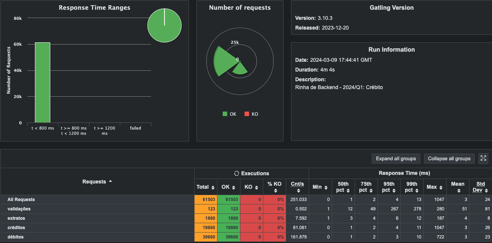

<h1 align="center"> Rinha de Backend</h1>


Este projeto foi desenvolvido para a participação da Rinha de backend, essa edição foi com foco em controle de concorrência.

Link para a rinha: https://github.com/zanfranceschi/rinha-de-backend-2024-q1/

## Stack

* Golang
* PostgreSQL
* Nginx

## Exemplo
A aplicação possui as seguintes funcionalidades:

### Realizar Transação
* POST /cliente/[id]transacoes
``` 
Payload:
{
    "valor": 10,
    "tipo" : "d",
    "descricao" : "EXEMPLO"
}
```
Resposta:
```
HTTP 200 OK

{
    "limite" : 100000,
    "saldo" : -100
}
```

### Consultar Extrato
* GET /cliente/[id]/extrato
```
{
  "saldo": {
    "total": -100,
    "data_extrato": "2024-02-27T03:30:40.217753Z",
    "limite": 100000
  },
  "ultimas_transacoes": [
    {
      "valor": 10,
      "tipo": "d",
      "descricao": "exemplo",
      "realizada_em": "2024-01-17T02:34:38.543030Z"
    }
  ]
}
``` 
### Execução
Na pasta docker:
```
docker-compose up 
```

### Performance

<p align="center">
  
</p>
